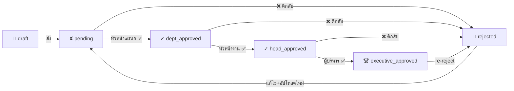

# 📚 NVC Academic — ระบบจัดส่งแผนการเรียนการสอน
> **Workflow & Infographic Reference**
> วิทยาลัยอาชีวศึกษานครปฐม
> Updated: 2569

---

## 🎯 ภาพรวมระบบ (System Overview)

**NVC Academic** คือระบบกลางสำหรับ
- 📤 ครูส่งแผนการเรียนรู้ / แผนฝึกอาชีพ / โครงการจัดการเรียนรู้
- ✅ ผู้บังคับบัญชาตรวจสอบและอนุมัติตามลำดับชั้น
- 🤖 AI ช่วยประเมินคุณภาพแผน
- 📄 ออกรายงานบันทึกข้อความ (PDF) อัตโนมัติ

### 🔧 เทคโนโลยีหลัก
| Component | Tech |
|---|---|
| ภาษาหลัก | PHP Vanilla (no framework) |
| Database | MySQL |
| Authentication | Google OAuth 2.0 |
| File Storage | Google Drive (Service Account) |
| AI | Google Vertex AI (Gemini) |
| UI Framework | Custom CSS + Font Awesome |

---

## 👥 บทบาทผู้ใช้งาน (User Roles)

```
┌──────────────────────────────────────────────────────────┐
│  Hierarchy                  สิทธิ์การเห็น                │
├──────────────────────────────────────────────────────────┤
│  👑 ADMIN                   ทุกแผนกทั้งระบบ                │
│  ⬇                                                        │
│  💼 ผู้บริหาร (executive)    ทุกแผนก                       │
│  ⬇                                                        │
│  🛡️ หัวหน้างาน (head)        ทุกแผนก                       │
│  ⬇                                                        │
│  📋 หัวหน้าแผนก (dept_head) เฉพาะแผนกตัวเอง                │
│  ⬇                                                        │
│  👨‍🏫 ครูผู้สอน (teacher)     เฉพาะของตัวเอง                 │
└──────────────────────────────────────────────────────────┘
```

### 🎭 หน้าที่หลักของแต่ละ Role

| Role | ส่งแผน | อนุมัติ | ดูภาพรวม | จัดการระบบ |
|------|:------:|:-------:|:--------:|:----------:|
| ครูผู้สอน | ✅ | — | เฉพาะของตน | — |
| หัวหน้าแผนก | ✅ | ขั้นที่ 1 (แผนกตน) | ทั้งระบบ (summary) | — |
| หัวหน้างาน | — | ขั้นที่ 2 | ทั้งระบบ | — |
| ผู้บริหาร | — | ขั้นที่ 3 (final) | ทั้งระบบ | — |
| ผู้ดูแลระบบ | — | ขั้นใดก็ได้ | ทั้งระบบ | ✅ |

---

## 🔄 Workflow หลัก — เส้นทางการส่งแผน

### Stage 1: เตรียมข้อมูล (Setup)

```
ครู Login (Google) → Profile Setup → ภาระงานสอน → พร้อมส่งแผน
                                      ↑
                          ระบุรายวิชาที่จะสอนในภาคเรียนนี้
```

**ภาระงานสอน (Teaching Load)** = รายวิชาที่ครูสอนในภาคเรียน
- กรอกข้อมูล: รหัสวิชา, ชื่อวิชา, ระดับชั้น, ห้อง

### Stage 2: ส่งเอกสาร (Submission)

ระบบรองรับ **3 ประเภทเอกสาร** แยกกัน:

```
┌────────────────────────────────────────────────────────────┐
│  📘 แผนการจัดการเรียนรู้   →  PDF + บันทึกข้อความ            │
│  🔧 แผนการฝึกอาชีพ        →  PDF + บันทึกข้อความ            │
│  📁 โครงการจัดการเรียนรู้  →  สำหรับรายวิชาที่ส่งทั้ง 2 แบบ   │
└────────────────────────────────────────────────────────────┘
```

### Stage 3: สถานะแผน (Status Flow)



| Status | ภาษาไทย | สี | ใครเห็น |
|--------|---------|----|----|
| `draft` | แบบร่าง | ⚪ เทา | เจ้าของ |
| `pending` | รอหัวหน้าแผนกอนุมัติ | 🟡 เหลือง | เจ้าของ + หน.แผนก |
| `dept_approved` | หัวหน้าแผนกอนุมัติแล้ว | 🔵 ฟ้า | + หน.งาน |
| `head_approved` | หัวหน้างานอนุมัติแล้ว | 🟢 เขียวอ่อน | + ผู้บริหาร |
| `executive_approved` | ผู้บริหารอนุมัติแล้ว | 💚 เขียวเข้ม | ทุกคน |
| `rejected` | ไม่อนุมัติ | 🔴 แดง | กลับมาที่เจ้าของ |

---

## 🤖 AI Evaluation — การประเมินด้วย AI

### 📊 เกณฑ์การประเมิน (11 ข้อย่อย × 5 คะแนน = 55 คะแนนเต็ม)

```
┌─── หมวดที่ 1: การวิเคราะห์ Job/Task & สมรรถนะ ───┐
│  1.1 วิเคราะห์ Job/Task & สมรรถนะวิชาชีพ          │
│  1.2 ระดับความสามารถ (K S A Ap)                  │
│  1.3 สอดคล้องมาตรฐานหลักสูตร สอศ. 2567           │
└──────────────────────────────────────────────────┘

┌─── หมวดที่ 2: กิจกรรมการเรียนการสอน ─────────────┐
│  2.1 นำเข้าสู่บทเรียน + แรงจูงใจ (ว PA 3)         │
│  2.2 Active Learning (MIAP / 5 Steps)            │
│  2.3 บูรณาการเศรษฐกิจพอเพียง/คุณธรรม              │
└──────────────────────────────────────────────────┘

┌─── หมวดที่ 3: สื่อ/ใบช่วยสอน ────────────────────┐
│  3.1 ใบงาน + ใบความรู้ ครบถ้วน                    │
│  3.2 สื่อดิจิทัล + เทคโนโลยีสมัยใหม่ (ว PA 4)      │
└──────────────────────────────────────────────────┘

┌─── หมวดที่ 4: การประเมิน ────────────────────────┐
│  4.1 เครื่องมือประเมินทักษะปฏิบัติ + Rubrics      │
│  4.2 ระบบ Feedback + การประเมินตามสภาพจริง       │
│  4.3 บันทึกหลังสอน + แนวทางแก้ปัญหา               │
└──────────────────────────────────────────────────┘
```

### 🎓 เกณฑ์ระดับคุณภาพจากคะแนนรวม

| คะแนน | ระดับ | สี |
|-------|------|----|
| 50-55 | 🌟 ดีเยี่ยม (excellent) | เขียวเข้ม |
| 42-49 | 👍 ดีมาก (very_good) | เขียว |
| 35-41 | ✓ ดี (good) | ฟ้า |
| 28-34 | ⚠️ พอใช้ (fair) | เหลือง |
| < 28 | 🔧 ปรับปรุง (needs_improvement) | แดง |

### 🛡️ ข้อจำกัด AI
- ❌ หัวหน้าแผนกห้ามใช้ AI ประเมินแผนของตัวเอง (รอหัวหน้างาน/ผู้บริหาร)
- ❌ ประเมินซ้ำเมื่ออนุมัติ executive_approved แล้วไม่ได้
- ❌ ประเมินบนแผนที่ถูกตีกลับไม่ได้

---

## 📑 รายงานบันทึกข้อความ (Memo Report)

แผนที่ `executive_approved` แล้ว → ระบบสร้าง **PDF บันทึกข้อความ** อัตโนมัติ

### โครงสร้างรายงาน
```
┌─────────────────────────────────────────────────┐
│  📄 หน้า 1: บันทึกข้อความ                          │
│  ─────────────────────────────                  │
│   • ส่วนราชการ, วันที่, เลขที่                     │
│   • เรียน ผู้อำนวยการ                              │
│   • รายละเอียดผู้ส่ง (ครู + แผนก + วิชา)           │
│   • การพัฒนาหลักสูตร (Self/Publisher)            │
│   • ลายเซ็นผู้จัดทำ                                │
└─────────────────────────────────────────────────┘
            ↓
┌─────────────────────────────────────────────────┐
│  📄 หน้า 2: แบบประเมินแผนการจัดการเรียนรู้           │
│  ─────────────────────────────                  │
│   • คะแนน AI ทั้ง 11 ข้อ                           │
│   • ความเห็นและข้อเสนอแนะ                          │
│   • ลายเซ็นผู้ประเมิน                              │
│      - แผนของครู → หัวหน้าสาขา                    │
│      - แผนของหน.แผนก → รองผอ.ฝ่ายวิชาการ          │
└─────────────────────────────────────────────────┘
            ↓
┌─────────────────────────────────────────────────┐
│  📄 หน้า 3: ผู้ลงนามอนุมัติ 4 ฝ่าย                    │
│  ─────────────────────────────                  │
│   1. ผู้จัดทำ (ครูเจ้าของแผน)                       │
│   2. หัวหน้าแผนก                                   │
│   3. หัวหน้างาน                                     │
│   4. ผู้บริหาร (รองผอ.ฝ่ายวิชาการ)                  │
│   → อนุมัติ/ลงนามโดย ผู้อำนวยการ                    │
└─────────────────────────────────────────────────┘
```

---

## 🗂️ การจัดเก็บไฟล์บน Google Drive

```
📁 NVC Academic Root
└── 📁 ปีการศึกษา 1/2569
    ├── 📁 แผนกวิชาเทคโนโลยีสารสนเทศ
    │   └── 📁 นายชานนท์ ปฏิพิมพาคม
    │       ├── 📁 การโปรแกรมเชิงวัตถุ (3204-2007)
    │       │   ├── 📄 แผนการเรียนรู้.pdf
    │       │   └── 📄 บันทึกหลังสอน.pdf
    │       └── 📁 ฐานข้อมูล (3204-2005)
    │           └── 📄 ...
    └── 📁 แผนกวิชาการบัญชี
        └── ...
```

**File naming pattern**: `ปีการศึกษา X ภาคเรียนที่ Y / แผนก / ครู / วิชา / file.pdf`

---

## 🔔 ระบบแจ้งเตือน (Notifications)

ครูได้รับการแจ้งเตือนเมื่อ:
- ✅ หัวหน้าแผนกอนุมัติ
- ✅ หัวหน้างานอนุมัติ
- ✅ ผู้บริหารอนุมัติ (final)
- ❌ มีการตีกลับให้แก้ไข
- 💬 มีคอมเมนต์ใหม่จากผู้ตรวจ

→ คลิกการแจ้งเตือน = ไปที่หน้า `/plans/view/<id>` ตรง

---

## 📊 Dashboard & Analytics

### 🎯 Dashboard — ภาพรวมเร็ว
- 📈 จำนวนแผน (ส่งแล้ว/รออนุมัติ/อนุมัติ/ตีกลับ)
- 📊 กราฟสัดส่วนแผนรายแผนก
- 🕐 แผนล่าสุด 10 รายการ
- 👥 ครูที่มีภาระงาน
- 🔔 ภาระงานสอนที่ยังไม่ตั้งค่า (สำหรับครู)

### 📉 Analytics — วิเคราะห์เชิงลึก
- 🎯 ภาพรวมตัวเลข
- 📋 อัตราการครอบคลุมแผนต่อแผนก
- 👤 อัตราการส่งแผนรายบุคคล
- 📊 แยกตามประเภท (เรียนรู้/ฝึกอาชีพ/โครงการ)

---

## 🛠️ ฟีเจอร์เสริม (Advanced Features)

### 🔄 Re-reject (ตีกลับหลังอนุมัติ)
หัวหน้างาน/ผู้บริหาร/admin สามารถ **ตีกลับ** แผนที่ `executive_approved` แล้วได้
→ กรณีพบข้อผิดพลาดภายหลัง

### 🔁 Switch Plan Type
ครูเปลี่ยน "ประเภทแผน" ได้
- teaching ↔ vocational
- หรือใช้ทั้ง 2 ประเภท (both) สำหรับวิชาเดียว

### 👑 Super Admin
admin ที่**ไม่มี department_id** → แก้ไขแผน/โครงการได้ทุกสถานะ ทุกแผนก โดยไม่บันทึก audit trail
→ สำหรับ admin ระบบจริงๆ ไม่ใช่ใครก็ได้ที่มี role=admin

### 🏷️ Badge "หัวหน้าแผนก"
หน้ารายการแผน/โครงการ/รายงาน/dashboard ที่แสดงครู
→ ถ้าครูคนนั้นเป็น dept_head → มี badge สีอำพันต่อท้ายชื่อ

### 📝 Quick Reply Chips (ตีกลับ)
ผู้ตรวจกดปุ่ม chip คำเหตุผลสำเร็จรูปเพื่อ insert ลงในกล่องคอมเมนต์
→ "ไฟล์ไม่ครบ", "ขาดใบช่วยสอน", "ปรับเกณฑ์ประเมิน" ฯลฯ

### 🖋️ Force Signature
admin สามารถบังคับใช้ลายเซ็นในรายงาน แม้ผู้ลงนามไม่ได้เซ็นจริง
→ สำหรับเอกสารเร่งด่วนพิเศษ

---

## 🔐 ความปลอดภัย (Security Model)

### Defense in Depth — 3 ชั้น

```
┌─────────────────────────────────────────────────────────┐
│  Layer 1: Router Authentication                        │
│   → requireAuth() ตรวจ role ก่อนเข้า controller         │
│   เช่น /admin/* ต้อง role=admin เท่านั้น                  │
└─────────────────────────────────────────────────────────┘
                          ↓
┌─────────────────────────────────────────────────────────┐
│  Layer 2: List Query Filtering                         │
│   → SQL WHERE clause กรองตาม dept/owner                │
│   ครูเห็นเฉพาะแผนตัวเอง, หน.แผนกเห็นเฉพาะแผนกตัวเอง       │
└─────────────────────────────────────────────────────────┘
                          ↓
┌─────────────────────────────────────────────────────────┐
│  Layer 3: Detail Page Permission                       │
│   → ตรวจสิทธิ์ก่อนแสดงเนื้อหา + คะแนน AI                  │
│   - viewPlan: teacher=own + dept_head=own dept         │
│   - AiController: dept_head=own dept                    │
│   - _reportCanView: same rules                          │
└─────────────────────────────────────────────────────────┘
```

### 🛡️ การป้องกันเฉพาะ
- **CSRF Token**: ทุก POST form มี token verify
- **XSS**: ใช้ `e()` (htmlspecialchars) ทุกการ render
- **SQL Injection**: PDO prepared statements
- **File Upload**: เฉพาะ PDF, ขนาด ≤ 100MB
- **Google OAuth Only**: ไม่มี password ในระบบ

---

## 📅 Use Case ตัวอย่าง (User Stories)

### 👨‍🏫 Story 1: ครูส่งแผน
```
1. Login ด้วย Google
2. กดเมนู "แผนการจัดการเรียนรู้" → "อัปโหลดแผนใหม่"
3. เลือกรายวิชา (จากภาระงานสอน)
4. กรอกชื่อแผน + เลือกประเภท
5. แนบ PDF
6. ส่ง → status = pending
7. รอ notification
```

### 📋 Story 2: หัวหน้าแผนกตรวจ
```
1. Login → กดเมนู "รออนุมัติ" (มี badge แจ้งจำนวน)
2. เห็นรายการ pending ในแผนกตัวเอง
3. กด "ตรวจสอบ" → ดูเนื้อหา + คะแนน AI
4. กรอกความเห็น + เลือก "อนุมัติ" หรือ "ไม่อนุมัติ"
5. แผนเปลี่ยน status เป็น dept_approved
6. ระบบไปแผนถัดไปอัตโนมัติ
```

### 🛡️ Story 3: หัวหน้างานดูภาพรวม
```
1. Login → กดเมนู "วิเคราะห์ข้อมูล"
2. เลือกตัวกรอง: ปีการศึกษา / แผนก / ครู
3. ดูกราฟ + ตาราง:
   - อัตราการส่งแผน
   - การครอบคลุมตามแผนก
   - คะแนน AI เฉลี่ย
4. กดแถวเพื่อดูรายละเอียดเฉพาะคน
```

### 🏆 Story 4: ผู้บริหารอนุมัติเอกสารสมบูรณ์
```
1. Login → "รออนุมัติ" → tab "หัวหน้างานอนุมัติแล้ว"
2. ตรวจรายละเอียด + คะแนน AI
3. กดอนุมัติ → status = executive_approved
4. ครูได้ notification
5. ระบบ generate รายงาน PDF (บันทึกข้อความ + ใบประเมิน)
```

---

## 📐 Visual Style สำหรับ Infographic

### 🎨 Color Palette
```
Primary Blue    #3b82f6  ████████  → Action, links
Emerald Green   #10b981  ████████  → Approved, success
Amber Yellow    #f59e0b  ████████  → Pending, warning
Purple          #8b5cf6  ████████  → Projects, special
Red             #ef4444  ████████  → Rejected, danger
Dark BG         #0f172a  ████████  → Background
```

### 🔤 Typography
- **Heading**: Noto Sans Thai Bold
- **Body**: Noto Sans Thai Regular
- **Document/Report**: Sarabun (สำหรับเอกสารราชการ)

### 🎯 Icon Set
- Font Awesome 6 Free
- ใช้ icon ที่สื่อความหมายชัดเจน เช่น 📄 📋 ✅ ⏳ 🔔

---

## 📌 Key Numbers / Stats (สำหรับ Infographic)

```
┌──────────────────────────────────────────┐
│  🏫 15 แผนกวิชา                            │
│  📚 3 ประเภทเอกสาร (เรียนรู้/ฝึก/โครงการ)   │
│  👥 5 บทบาทผู้ใช้                           │
│  📊 11 เกณฑ์ AI ประเมิน                     │
│  ⭐ 55 คะแนนเต็ม                            │
│  🎯 5 ระดับคุณภาพ                            │
│  🔐 3 ชั้น Defense in Depth                  │
│  🔄 6 สถานะ Workflow                        │
└──────────────────────────────────────────┘
```

---

## 🗺️ Sitemap (โครงสร้างเมนู)

```
NVC Academic
│
├─📌 เมนูหลัก
│  ├─ 🏠 แดชบอร์ด (Dashboard)
│  ├─ 📁 โครงการจัดการเรียนรู้ (Projects)
│  ├─ 📘 แผนการจัดการเรียนรู้ (Teaching Plans)
│  └─ 🔧 แผนการฝึกอาชีพ (Vocational Plans)
│
├─📤 เมนูอัปโหลด
│  ├─ อัปโหลดโครงการ
│  ├─ อัปโหลดแผนการจัดการเรียนรู้
│  └─ อัปโหลดแผนการฝึกอาชีพ
│
├─📊 รายงาน
│  ├─ 📄 รายงานแผนและโครงการ (Memo Reports)
│  └─ 🎓 ตรวจระดับชั้นสอน
│
├─✅ การอนุมัติ
│  ├─ 🔴 รออนุมัติ (Pending) — มี badge แจ้งเตือน
│  ├─ 📜 ประวัติการอนุมัติ
│  └─ 📈 วิเคราะห์ข้อมูล (Analytics)
│
└─⚙️ จัดการระบบ (Admin only)
   ├─ 👥 จัดการผู้ใช้
   ├─ 🏫 จัดการแผนก
   ├─ 📚 ภาระงานสอน
   ├─ 📅 ปีการศึกษา
   ├─ 🎯 ตรวจสอบระดับชั้น (Class Assignments)
   └─ ⚙️ ตั้งค่าระบบ + Report Officials
```

---

## 💡 Key Differentiators (จุดเด่นที่ใช้โปรโมต)

1. **🤖 AI-Powered Quality Check** — ประเมินคุณภาพแผนอัตโนมัติด้วย Gemini
2. **⛓️ Multi-Level Approval** — workflow อนุมัติ 3 ระดับชัดเจน
3. **☁️ Google Drive Integration** — ไฟล์เก็บอย่างเป็นระเบียบ ไม่ใช้พื้นที่ server
4. **📄 Auto-Generate Memo** — สร้างบันทึกข้อความ PDF อัตโนมัติพร้อมลายเซ็น
5. **📊 Real-time Analytics** — ติดตามการส่งแผนรายบุคคล/แผนก/ภาคเรียน
6. **🔔 Smart Notifications** — แจ้งเตือนทุกการเปลี่ยนสถานะ
7. **🔐 Defense in Depth Security** — กันการเข้าถึงข้ามแผนก 3 ชั้น
8. **🎨 Modern Dark UI** — ใช้งานสบายตา ดีไซน์ทันสมัย

---

## 📝 ข้อมูลติดต่อ / Credits

```
DEVELOPED BY
   ชานนท์ ปฏิพิมพาคม
   สิริพรชัย ศักดาประเสริฐ

วิทยาลัยอาชีวศึกษานครปฐม
สำนักงานคณะกรรมการการอาชีวศึกษา (สอศ.)
กระทรวงศึกษาธิการ
```

---

> 🎨 **Infographic Tip**:
> ใช้เอกสารนี้เป็น script ในการสร้าง infographic โดย:
> - แบ่ง section ตามหัวข้อใหญ่ (1 หัวข้อ = 1 frame)
> - ใช้ flowchart สำหรับ workflow (status flow + use cases)
> - ใช้ pie chart / bar chart สำหรับสถิติ
> - ใช้ hierarchy diagram สำหรับ user roles
> - ใช้ icon + sparse text ตามเทรนด์ minimalist
> - color scheme: ใช้ palette ที่ระบุไว้
