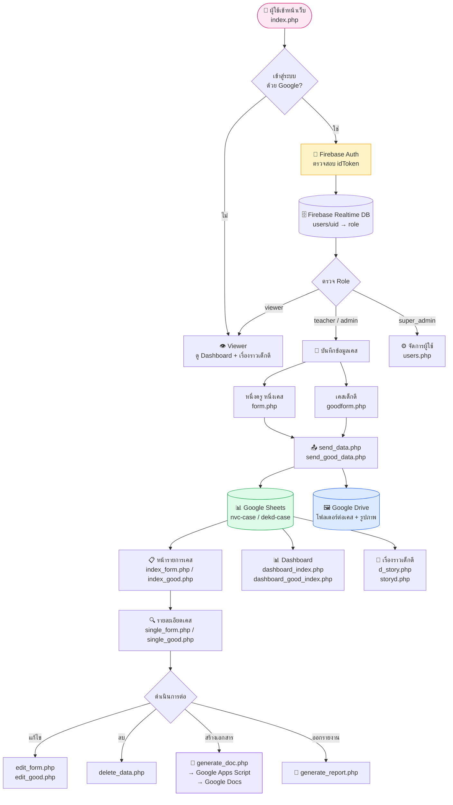
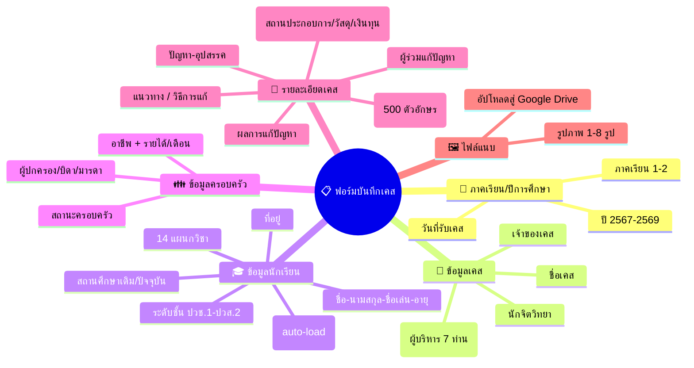
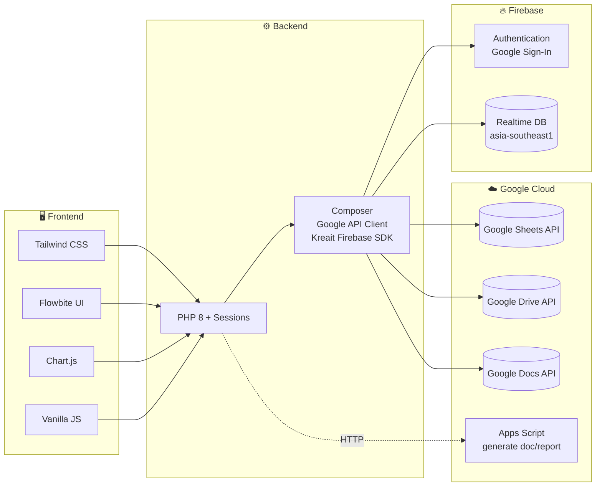

# 🎨 Infographic Script — ระบบ "หนึ่งครู หนึ่งเคส" (One Teacher One Case)

> สคริปต์สำหรับจัดทำ Infographic แสดง Workflow การใช้งานระบบทั้งหมด
> **โครงการ:** ศูนย์ครูดี วิทยาลัยอาชีวศึกษานครปฐม (Nakhon Pathom Vocational College)
> **คำขวัญ:** "เรียนดี มีความสุข"

---

## 🧭 SECTION 1 — ภาพรวมระบบ (Hero / Top Banner)

**หัวเรื่อง (H1):**
> 🏫 ระบบบริหารจัดการเคสนักเรียน "หนึ่งครู หนึ่งเคส"

**Sub-text:**
> เว็บไซต์เพื่อช่วยเหลือนักเรียนที่มีปัญหาหรืออุปสรรคในการเรียนรู้
> ผ่านการทำงานร่วมกับครูที่ปรึกษา และยกย่องเชิดชู "เคสเด็กดี"

**KPI Boxes (วางเป็นการ์ดแนวนอน 4 ใบ):**

| 📁 ประเภทเคส | 👥 บทบาทผู้ใช้ | 🔐 การยืนยันตัวตน | ☁️ การจัดเก็บข้อมูล |
|:---:|:---:|:---:|:---:|
| 2 ระบบ<br>(หนึ่งครูฯ / เด็กดี) | 4 บทบาท<br>(viewer→super_admin) | Google Sign-In<br>(Firebase Auth) | Google Sheets<br>+ Google Drive |

---

## 🔄 SECTION 2 — Workflow หลัก (Flowchart กลางอินโฟ)



---

## 🧑‍🤝‍🧑 SECTION 3 — บทบาทผู้ใช้ (Role Matrix)

จัดวางเป็นตาราง 4 คอลัมน์ พร้อมไอคอน

| บทบาท | ไอคอน | สิทธิ์การใช้งาน | สีประจำ |
|---|:---:|---|:---:|
| **viewer** | 👁️ | ดู Dashboard, ดูเรื่องราวเด็กดี, ดูข้อมูลศูนย์ | 🩷 Pink |
| **teacher** | 👨‍🏫 | + บันทึก/แก้ไข/ลบเคสของตนเอง, สร้างเอกสาร | 💙 Blue |
| **admin** | 🛠️ | + จัดการเคสทั้งหมด (ทุกแผนกวิชา) | 💚 Green |
| **super_admin** | 👑 | + จัดการผู้ใช้ระบบ (กำหนด role / ลบผู้ใช้) | ❤️ Red |

**หมายเหตุ:** ผู้ใช้ใหม่จะถูกกำหนด role เริ่มต้นเป็น `viewer` อัตโนมัติเมื่อล็อกอินครั้งแรก

---

## 📋 SECTION 4 — สองสายงาน (Two Tracks)

### 🩷 Track A — "หนึ่งครู หนึ่งเคส" (One Teacher One Case)
> เคสนักเรียนที่มี **ปัญหา/อุปสรรค** ต้องช่วยเหลือ

**สถานะเคส (Status Pie):**
- 🟠 กำลังดำเนินการ
- 🔵 เสร็จสมบูรณ์และติดตาม
- 🟢 เสร็จสมบูรณ์
- 🔴 ไม่สำเร็จ

### 💙 Track B — "เคสเด็กดี" (Good Students)
> เคสนักเรียนที่มี **ความดี / ผลงานโดดเด่น** ควรยกย่อง

**สถานะเคส:**
- 🟡 เด็กปกติ
- 🔵 เด็กดี
- 🟢 Excellent

---

## 📝 SECTION 5 — ขั้นตอนการบันทึกเคส (5-Step Process)

> ไอคอน 5 ขั้นในแถบแนวนอน

```
 ① เข้าสู่ระบบ      ② เลือกประเภทเคส     ③ กรอกฟอร์ม         ④ อัปโหลดรูป (สูงสุด 8)   ⑤ บันทึก
    🔐               🩷 / 💙              📋                  🖼️                       ✅
 Google Sign-In  →  หนึ่งครู / เด็กดี  → ข้อมูลนักเรียน    →  Google Drive            →  Google Sheets
                                       + ครอบครัว                                       + Case Number
                                       + รายละเอียด                                      (CASE-001, 002...)
```

**ข้อมูลที่ต้องกรอก (Form Sections):**



---

## 🏛️ SECTION 6 — Tech Stack (Layer Diagram)



---

## 📊 SECTION 7 — Dashboard & Reporting

**หน้าหลัก (index.php)** มี Dashboard 2 ตัวเลือกสลับได้:

| Dashboard | กราฟ | ตัวชี้วัด |
|---|---|---|
| 🩷 หนึ่งครู หนึ่งเคส | Pie สถานะเคส + Stacked Bar แยกแผนก/ระดับชั้น | จำนวนเคสรวม, แยกสถานะ 4 แบบ |
| 💙 เคสเด็กดี | Pie สถานะเด็ก + Stacked Bar แยกแผนก/ระดับชั้น | จำนวนเคสรวม, แยกสถานะ 3 แบบ |

**หน้าเรื่องราว (d_story.php):**
- แสดงเรื่องราวเด็กดีแบบ Feed (รูปภาพ + เนื้อเรื่อง)
- เรียงจากใหม่ → เก่า
- กรองตามแผนกวิชา / ระดับชั้นได้

**สร้างเอกสารอัตโนมัติ:**
- `generate_doc.php` → Google Apps Script → สร้าง **Google Docs** จากเทมเพลตเคส
- `generate_report.php` → สร้าง **รายงานสรุป** สำหรับผู้บริหาร

---

## 🗂️ SECTION 8 — โครงสร้างไฟล์ (Mini Sitemap)

```
nvc-case/
├── 🏠 index.php ........................ หน้าหลัก + Dashboard switcher
├── 🎨 style.php ........................ CSS รวม
│
├── 📁 page/ ............................ หน้า UI
│   ├── about.php ....................... ข้อมูลศูนย์
│   ├── d_story.php ..................... เรื่องราวเด็กดี (Feed)
│   ├── form.php / goodform.php ......... ฟอร์มบันทึก 2 ประเภท
│   ├── index_form.php / index_good.php . รายการเคส
│   ├── single_form.php / single_good.php รายละเอียดเคส
│   ├── edit_form.php / edit_good.php ... แก้ไขเคส
│   └── users.php ....................... จัดการผู้ใช้ (super_admin)
│
├── 📁 sheets/ .......................... Backend API
│   ├── connect.php ..................... เชื่อม Google API
│   ├── options.php ..................... ตัวเลือก dropdown
│   ├── send_data.php / send_good_data.php บันทึกเคสใหม่
│   ├── fetch_data.php / fetch_good_data.php ดึงข้อมูล (JSON)
│   ├── update_data.php / update_good_data.php อัปเดต
│   ├── delete_data.php / delete_image.php ลบ
│   ├── detail_data.php ................. รายละเอียด
│   ├── dashboard_*.php ................. Dashboard UI
│   ├── list.php / listg.php ............ ตารางรายการ
│   ├── generate_doc.php ................ สร้าง Google Docs
│   └── generate_report.php ............. สร้างรายงาน
│
├── 📁 templates/ ....................... UI partials
│   ├── header.php ...................... Navbar + Sidebar (role-aware)
│   ├── footer.php
│   └── modal_*.php ..................... ยืนยัน/ลบ/แก้ไข/โหลด/รีเซ็ต
│
└── 📁 firebase/ ........................ Auth
    ├── firebase_config.js .............. Google Sign-In (Client)
    ├── login_config.php ................ ตรวจ idToken + สร้าง Session
    └── logout_config.php
```

---

## 🔁 SECTION 9 — Data Flow แบบสรุป (1 บรรทัด)

```
👤 User → 🔐 Google Login → 🔥 Firebase verify → 📋 PHP Session
     ↓
📝 Form submit → ☁️ Google Drive (upload images) → 📊 Google Sheets (append row, CASE-XXX)
     ↓
📊 Dashboard ← 🔄 fetch_data.php ← Google Sheets API
     ↓
🔍 Single view → 📄 Apps Script → Google Docs (export เอกสารราชการ)
```

---

## 🎯 SECTION 10 — เป้าหมายของระบบ (Footer / CTA)

> 💡 **"โมเดลต้นแบบศูนย์ครูดี หนึ่งครู หนึ่งเคส"**
>
> - 🤝 ช่วยเหลือนักเรียนที่มีอุปสรรคในการเรียนรู้แบบเฉพาะรายบุคคล
> - 🌟 ยกย่องเชิดชูเด็กดีให้เป็นแบบอย่าง
> - 📈 รวบรวมข้อมูลเชิงสถิติเพื่อบริหารจัดการระดับสถานศึกษา
> - 📑 ลดงานเอกสารด้วยการสร้างรายงานอัตโนมัติจาก Google Workspace

---

## 🎨 SECTION 11 — Style Guide สำหรับ Infographic

**Color Palette (จากระบบจริง):**

| สี | HEX | ใช้กับ |
|---|---|---|
| 🩷 Pink-Purple Gradient | `from-purple-400 to-pink-500` | Track หนึ่งครู หนึ่งเคส |
| 💙 Purple-Cyan Gradient | `from-purple-500 to-cyan-500` | Track เคสเด็กดี |
| 🟠 Orange | `#f59e0b` | กำลังดำเนินการ |
| 🟢 Green | `#16a34a` | เสร็จสมบูรณ์ / Excellent |
| 🔴 Red | `#ef4444` | ไม่สำเร็จ / เมนูพิเศษ |
| 🔵 Blue | `#2563eb` | ติดตาม / เด็กดี |

**Font:** Sarabun / Prompt (ภาษาไทย), Inter (ภาษาอังกฤษ)

**Layout แนะนำ:**
- **แนวตั้ง** (1080 × 4500 px) สำหรับ Social/Print
- แบ่งเป็น 11 sections ตามด้านบน
- ใช้ไอคอนแบบ Outline (Heroicons) ให้สอดคล้องกับระบบจริง
- โลโก้วิทยาลัยอยู่หัวและท้าย

---

## ✅ Checklist สำหรับนักออกแบบ

- [ ] Hero banner + โลโก้ + คำขวัญ
- [ ] Flowchart workflow หลัก (Section 2)
- [ ] Role matrix 4 บทบาท (Section 3)
- [ ] Two-track comparison (Section 4)
- [ ] 5-step process bar (Section 5)
- [ ] Tech stack layer (Section 6)
- [ ] Dashboard preview screenshots (Section 7)
- [ ] Sitemap / File tree (Section 8)
- [ ] Data flow oneliner (Section 9)
- [ ] CTA + เป้าหมายโครงการ (Section 10)
- [ ] ใช้ Color palette ตามระบบ (Section 11)

---

> 📌 ไฟล์นี้สรุปจากการวิเคราะห์โค้ดทั้ง repo `nvc-case/` — สามารถส่งต่อให้กราฟิกดีไซเนอร์ใช้เป็น **สคริปต์** ผลิตอินโฟกราฟิกได้ทันที
